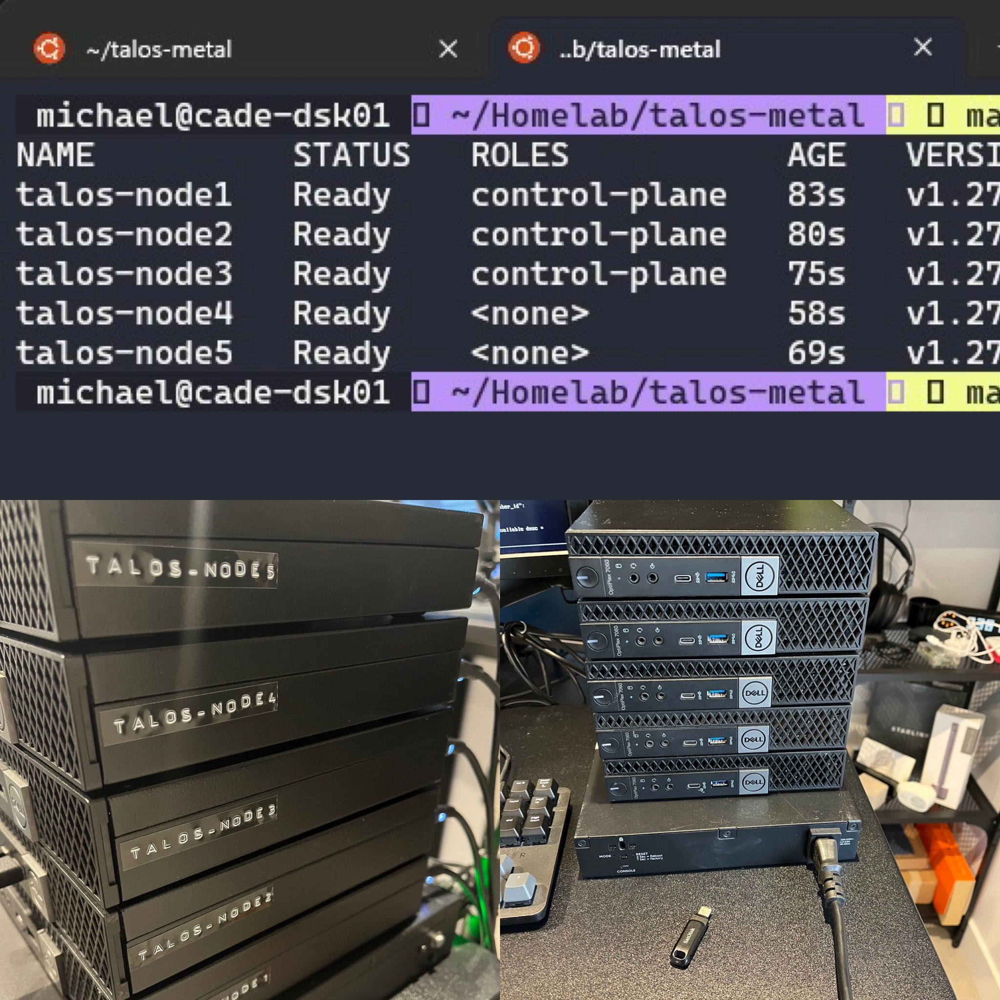

## Talos Linux on Metal 

This walkthrough is used in my home lab environment which consists of 

5 x Dell Optiplex 7060 
i5-8500T (6 Cores, 6 threads) 
32GB RAM 
256GB SSD 
512GB m.2 nvme

Dell X1026 - 24 Port Switch



## Current State / Update 

We have a 5 node (3 x Control Plane)(2 x Worker node) cluster running Talos Linux with configuration file in this folder. This Readme is so that I can remember how to start from scratch and help anyone else that stumbles across said readme to do the same in their homelab environment. 

A 5 node cluster with the OS being installed on the SSD drives, the nvme drives will be used in a CEPH cluster. 

I also have a shared NAS device which will be used by the cluster with the (CSI-Driver-NFS)[https://github.com/kubernetes-csi/csi-driver-nfs?tab=readme-ov-file] Details and process shared below.

To Do list (as of 28th Feb 2024)
- Acquire Hardware [✔️]
- Talos Configuration [✔️]
- Cilium CNI [✔️]
- Cilium IPAM [✔️]
- CEPH Cluster [✔️]
- Kasten K10 
- Kubevirt 
- Cert-Manager 
- ArgoCD 

The above list and order may need to change but for now this is part of the learning curve, the overall goal is to leverage Kargo (Project Listed Below) for the automation of this. 

## Getting Started 

From scratch I downloaded the Talos Linux ISO from the (Talos Release Page)[https://github.com/siderolabs/talos/releases/latest/] I then added this to my (Ventoy)[https://www.ventoy.net/en/index.html] Ventoy is an Open Source tool to create a bootable USB for ISO files. I then went through the manual process on each node of booting from the USB. 

On your workstation we will need `talosctl` this a CLI tool which interfaces with the TalosAPI, We can find out the steps required here in the (Getting Started)[https://www.talos.dev/v1.6/introduction/getting-started/] guide. 

Networking wise I have chosen static IPs in my network that I can use for both the VIP and each node without affecting DHCP on my home network. It is quite simple to run through and configure each node with this static IP address. `F3` and then change the values to your network configuration. 

## Configuration Files 

Next up we need to create some config files, you will see these steps documented but for me I am going to note down my steps. With the below command I am specifically using this version of Kubernetes because some software that I want to use supports up to this version and not 1.28. My cluster name is `talos-metal` and my endpoint or my VIP address is the address along with the port 6443. 

```
talosctl gen config --kubernetes-version=1.27.7 talos-metal https://192.168.169.210:6443
```

This will create 3 files, controlplane.yaml, worker.yaml and talosconfig. These files can also be found in the folder here. I have since modified these configurations so that I create a bridge network for each node you will see this below. 

## Validate Configuration 

```
talosctl validate --config talos-node1-controlplane.yaml --mode metal
talosctl validate --config talos-node2-controlplane.yaml --mode metal
talosctl validate --config talos-node3-controlplane.yaml --mode metal
talosctl validate --config talos-node4-worker.yaml --mode metal
talosctl validate --config talos-node5-worker.yaml --mode metal

```

## Apply the Config 

Now that we have our config files and we have our physical nodes ready with a static IP we can now apply said config to our nodes. 

*Note - I have modified the controlplane.yaml with a number of additional configurations required for my setup, one of which is the ability to run workloads on our control plane nodes*

```
# Apply the cluster configuration to each node
talosctl apply-config \
    --nodes 192.168.169.211 \
    --endpoints 192.168.169.211 \
    --file talos-node1-controlplane.yaml \
    --insecure 

talosctl apply-config \
    --nodes 192.168.169.212 \
    --endpoints 192.168.169.212 \
    --file talos-node2-controlplane.yaml \
    --insecure 

talosctl apply-config \
    --nodes 192.168.169.213 \
    --endpoints 192.168.169.213 \
    --file talos-node3-controlplane.yaml \
    --insecure 

talosctl apply-config \
    --nodes 192.168.169.214 \
    --endpoints 192.168.169.214 \
    --file talos-node4-worker.yaml \
    --insecure 

talosctl apply-config \
    --nodes 192.168.169.215 \
    --endpoints 192.168.169.215 \
    --file talos-node5-worker.yaml \
    --insecure 
```

On the console of your nodes you will see some activity at this stage, it is important that until the reboot phase takes place and the state is ready you cannot move to the next step. 


## Kubernetes Bootstrap 
If everything is ready then we can instruct the bootstrap process, I am choosing one of my 5 nodes `talos-node1` 
 
```
talosctl bootstrap \
    --nodes 192.168.169.211 \
    --endpoints 192.168.169.211 \
    --talosconfig talosconfig
```

## Interact with cluster 

We can interact with our cluster using the `talos-metal` config file we created earlier. 

`kubectl --kubeconfig=talos-metal get pods`


We can also merge to our KUBECONFIG with the following: 

```
KUBECONFIG=~/.kube/config:kubeconfig kubectl config view --flatten > ~/.kube/config_tmp
mv ~/.kube/config_tmp ~/.kube/config
kubectl config get-contexts
```

## NFS StorageClass 
I have an NFS Shared storage device on my network that can be used above and beyond the local fast CEPH cluster. 

```
helm repo add csi-driver-nfs https://raw.githubusercontent.com/kubernetes-csi/csi-driver-nfs/master/charts
helm install csi-driver-nfs csi-driver-nfs/csi-driver-nfs --namespace kube-system --version v4.6.0 --set externalSnapshotter.enabled=true --set controller.runOnControlPlane=true --set controller.replicas=2
```

StorageClass 

`kubectl apply -f nfs/sc-nfs.yml` 


SnapshotClass 

`kubectl apply -f nfs/snapshotclass-nfs.yaml`


default storageclass 

`kubectl patch storageclass nfs-csi -p '{"metadata": {"annotations":{"storageclass.kubernetes.io/is-default-class":"true"}}}'`

Test with PVC 

`kubectl apply -f nfs/pvc-nfs.yml`

## Cilium 
We have removed the default flannel CNI from our control plane and worker yaml configurations so we will need to install Cilium via a helm chart I achieved this through the (kargo project dev container)[https://github.com/ContainerCraft/Kargo]. 

`helm repo add cilium https://helm.cilium.io/`

`helm upgrade cilium cilium/cilium --namespace=kube-system -f cilium/cilium-values.yaml --version 1.14.7`

`kubectl apply -f cilium/cilium-l2announcement.yaml`

In my instance we would also like to create a range of IPs available on our network if a loadbalancer is required 

`kubectl apply -f cilium/cilium-ip-ipam.yaml `

This allows me to use 192.168.169.190-199 as available addresses 

## Rook Ceph 

[Important Docs - Talos + Ceph](https://www.talos.dev/v1.6/kubernetes-guides/configuration/ceph-with-rook/)

I am using the helm chart here which can be added with `helm repo add rook-release https://charts.rook.io/release`

Firstly, install the rook-ceph operator with the following command: 

`helm install --create-namespace --namespace rook-ceph rook-ceph rook-release/rook-ceph`

A useful command to determine your available disks would be to pick one of your nodes and run this command. 

`talosctl disks --talosconfig talosconfig -n 192.168.169.211`

I took the nvme from the output above and confirmed over all nodes in the cluster and then made changes to the relevant files listed below. I decided that this was a good first step vs creating a cluster then realising that we did not have empty disks. The following commands will clear the disks.

The following string of commands are useful when wiping disks pre ceph cluster creation
```
kubectl apply -f rook-ceph/disk-talos-node1.yaml -n rook-ceph
kubectl wait --timeout=900s --for=jsonpath='{.status.phase}=Succeeded' pod disk-wipe -n rook-ceph
kubectl logs disk-wipe -n rook-ceph

kubectl delete pod disk-wipe -n rook-ceph && kubectl apply -f rook-ceph/disk-talos-node2.yaml -n rook-ceph
kubectl wait --timeout=900s --for=jsonpath='{.status.phase}=Succeeded' pod disk-wipe -n rook-ceph
kubectl logs disk-wipe -n rook-ceph

kubectl delete pod disk-wipe -n rook-ceph && kubectl apply -f rook-ceph/disk-talos-node3.yaml -n rook-ceph
kubectl wait --timeout=900s --for=jsonpath='{.status.phase}=Succeeded' pod disk-wipe -n rook-ceph 
kubectl logs disk-wipe -n rook-ceph

kubectl delete pod disk-wipe -n rook-ceph && kubectl apply -f rook-ceph/disk-talos-node4.yaml -n rook-ceph
kubectl wait --timeout=900s --for=jsonpath='{.status.phase}=Succeeded' pod disk-wipe -n rook-ceph
kubectl logs disk-wipe -n rook-ceph

kubectl delete pod disk-wipe -n rook-ceph && kubectl apply -f rook-ceph/disk-talos-node5.yaml -n rook-ceph
kubectl wait --timeout=900s --for=jsonpath='{.status.phase}=Succeeded' pod disk-wipe -n rook-ceph
kubectl logs disk-wipe -n rook-ceph
```
The following commands will delete the metadata. 

```
kubectl apply -f rook-ceph/meta-talos-node1.yaml -n rook-ceph
kubectl wait --timeout=900s --for=jsonpath='{.status.phase}=Succeeded' pod disk-clean -n rook-ceph
kubectl logs disk-clean -n rook-ceph

kubectl delete pod disk-clean -n rook-ceph && kubectl apply -f rook-ceph/meta-talos-node2.yaml -n rook-ceph
kubectl wait --timeout=900s --for=jsonpath='{.status.phase}=Succeeded' pod disk-clean -n rook-ceph
kubectl logs disk-clean -n rook-ceph

kubectl delete pod disk-clean -n rook-ceph && kubectl apply -f rook-ceph/meta-talos-node3.yaml -n rook-ceph
kubectl wait --timeout=900s --for=jsonpath='{.status.phase}=Succeeded' pod disk-clean -n rook-ceph
kubectl logs disk-clean -n rook-ceph

kubectl delete pod disk-clean -n rook-ceph && kubectl apply -f rook-ceph/meta-talos-node4.yaml -n rook-ceph
kubectl wait --timeout=900s --for=jsonpath='{.status.phase}=Succeeded' pod disk-clean -n rook-ceph
kubectl logs disk-clean -n rook-ceph

kubectl delete pod disk-clean -n rook-ceph && kubectl apply -f rook-ceph/meta-talos-node5.yaml -n rook-ceph
kubectl wait --timeout=900s --for=jsonpath='{.status.phase}=Succeeded' pod disk-clean -n rook-ceph
kubectl logs disk-clean -n rook-ceph
```
Once our disks are clean, we can then create our cluster using the following command 

` helm install --create-namespace --namespace rook-ceph rook-ceph-cluster --set operatorNamespace=rook-ceph rook-release/rook-ceph-cluster -f rook-ceph/ceph-cluster-values.yaml `

Once the above command is ran you should run this following command to confirm your cluster is successful, I found after a few attempts of this we had issues with PodSecurityPolicies so updated the talos controlplane configs to exclude PSP on the `rook-ceph` namespace. 

`watch kubectl --namespace rook-ceph get cephcluster rook-ceph`


Initial Authentication can be achieved with a port forward to the dashboard 

`kubectl port-forward svc/rook-ceph-mgr-dashboard -n rook-ceph 8443:8443`

Then to authenticate we need our default username `admin` and our password can be obtained with: 

`kubectl -n rook-ceph get secret rook-ceph-dashboard-password -o jsonpath="{['data']['password']}" | base64 --decode && echo`

If you followed along to with Cilium then you might also now want to expose the ceph dashboard using IP PAM you can create this service for that 

`kubectl apply -f rook-ceph/ceph-dashboard-LB.yaml`

If you have done both NFS and Ceph then it is likely that you now have two default storageclasses this can be changed with the following command: This will remove the default annotation on the nfs-csi storageclass.  

`kubectl patch storageclass nfs-csi  -p '{"metadata": {"annotations":{"storageclass.kubernetes.io/is-default-class":"false"}}}'`

Note that I after also playing with Cilium Ingress we created a manual ingress for the dashboard, would need to test more from scratch on if this is needed or not if this can be enabled through helm values. 

`kubectl apply -f rook-ceph/ceph-ingress.yaml` 

## Kasten K10 

## Kubevirt 

## Cert-Manager 

Work in Progress 

`helm repo add jetstack https://charts.jetstack.io --force-update`

`helm repo update`

```
helm install \
  cert-manager jetstack/cert-manager \
  --namespace cert-manager \
  --create-namespace \
  --version v1.14.4 \
  --set installCRDs=true
```


## Reset 
Every now and again there will be a configuration change or a requirement to reset the cluster back to fresh, this will refresh it back to a stage with no static IP addresses. 

```
talosctl reset --debug \
    --nodes 192.168.169.211 \
    --endpoints 192.168.169.211 \
    --system-labels-to-wipe STATE \
    --system-labels-to-wipe EPHEMERAL \
    --graceful=false \
    --talosconfig talosconfig \
    --reboot

talosctl reset --debug \
    --nodes 192.168.169.212 \
    --endpoints 192.168.169.212 \
    --system-labels-to-wipe STATE \
    --system-labels-to-wipe EPHEMERAL \
    --graceful=false \
    --talosconfig talosconfig \
    --reboot

talosctl reset --debug \
    --nodes 192.168.169.213 \
    --endpoints 192.168.169.213 \
    --system-labels-to-wipe STATE \
    --system-labels-to-wipe EPHEMERAL \
    --graceful=false \
    --talosconfig talosconfig \
    --reboot

talosctl reset --debug \
    --nodes 192.168.169.214 \
    --endpoints 192.168.169.214 \
    --system-labels-to-wipe STATE \
    --system-labels-to-wipe EPHEMERAL \
    --graceful=false \
    --talosconfig talosconfig \
    --reboot

talosctl reset --debug \
    --nodes 192.168.169.215 \
    --endpoints 192.168.169.215 \
    --system-labels-to-wipe STATE \
    --system-labels-to-wipe EPHEMERAL \
    --graceful=false \
    --talosconfig talosconfig \
    --reboot
```

## Rebuild after Reset 
When the above reset is made it will remove those static IP addresses, we will need to run the below to apply configuration. Note that these IP addresses (DHCP) might change. 


```
talosctl apply-config \
    --nodes 192.168.169.98 \
    --endpoints 192.168.169.98 \
    --file talos-node1-controlplane.yaml \
    --insecure 

talosctl apply-config \
    --nodes 192.168.169.74 \
    --endpoints 192.168.169.74 \
    --file talos-node2-controlplane.yaml \
    --insecure 

talosctl apply-config \
    --nodes 192.168.169.56 \
    --endpoints 192.168.169.56 \
    --file talos-node3-controlplane.yaml \
    --insecure 

talosctl apply-config \
    --nodes 192.168.169.36 \
    --endpoints 192.168.169.36 \
    --file talos-node4-worker.yaml \
    --insecure 

talosctl apply-config \
    --nodes 192.168.169.100 \
    --endpoints 192.168.169.100 \
    --file talos-node5-worker.yaml \
    --insecure 
```